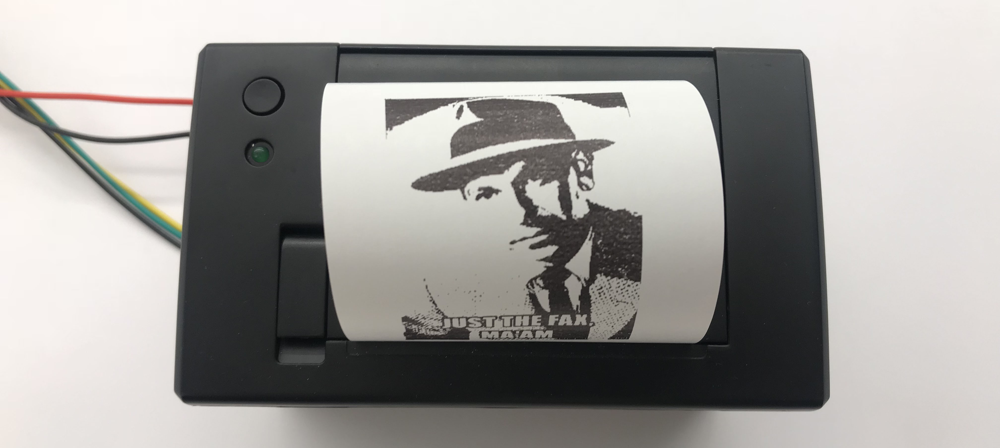

# Portable Fax Machine
This repository demonstrates how to create a portable fax machine using a Raspberry Pi and Twilio services.

#### Hardware requirements
*  [Raspberry Pi](https://www.amazon.com/gp/product/B07BC6WH7V/ref=oh_aui_detailpage_o08_s00?ie=UTF8&psc=1)
* [MicroSD Memory Card](https://www.amazon.com/gp/product/B06XWN9Q99/ref=oh_aui_detailpage_o06_s00?ie=UTF8&psc=1)
* [Thermal Printer](https://www.amazon.com/Adafruit-Thermal-Receipt-Printer-ADA597/dp/B00XW2K422/ref=sr_1_3?s=electronics&ie=UTF8&qid=1522874141&sr=1-3&keywords=thermal+printer+adafruit)
* [5V 2A AC Adapter](https://www.amazon.com/Mount-Adapters-2000mA-switching-supply/dp/B0137K4WGW)
* Cellular connectivity
	* [Programmable Wireless SIM card](https://www.twilio.com/console/wireless/orders/new)
	* [Raspberry Pi 3G-4G/LTE Base Shield](http://sixfab.com/product/raspberry-pi-3g-4glte-base-shield-v2/)
	* [Quectel 4G/LTE module](http://sixfab.com/product/quectel-ec25-mini-pcle-4glte-module/) **or** [Quectel 3G module](http://sixfab.com/product/quectel-uc20-mini-pcle-3g-module/)
* Optional
	* [USB to TTL adapter](https://www.amazon.com/gp/product/B075N82CDL/ref=oh_aui_detailpage_o05_s00?ie=UTF8&psc=1)

#### Additional Requirements
* [Twilio account](https://www.twilio.com/try-twilio)

#### Software and services
* Server/Client
	* [Node.JS](https://nodejs.org/en/)
* Services
	* [Programmable Fax](https://www.twilio.com/fax)
	* [Programmable Wireless](https://www.twilio.com/wireless)
	* [Sync](https://www.twilio.com/sync)

#### Hardware Guides/Instructions
Follow along with these guides to
1. [Set up the Raspbian operating system](http://thisdavej.com/beginners-guide-to-installing-node-js-on-a-raspberry-pi/)
2. [Set up the thermal printer](https://learn.adafruit.com/networked-thermal-printer-using-cups-and-raspberry-pi/overview)
3. [Set up the SixFab 3G/4G modem](http://sixfab.com/updated-tutorial-3-make-a-ppp-internet-connection-with-3g-4glte-shields-on-raspberry-pi/)

#### Software Guides
Follow along in each folder in this repository to
1. [Set up your Twilio services](/runtime)
2. [Set up your server](/server)
3. [Set up your client](/pi)
